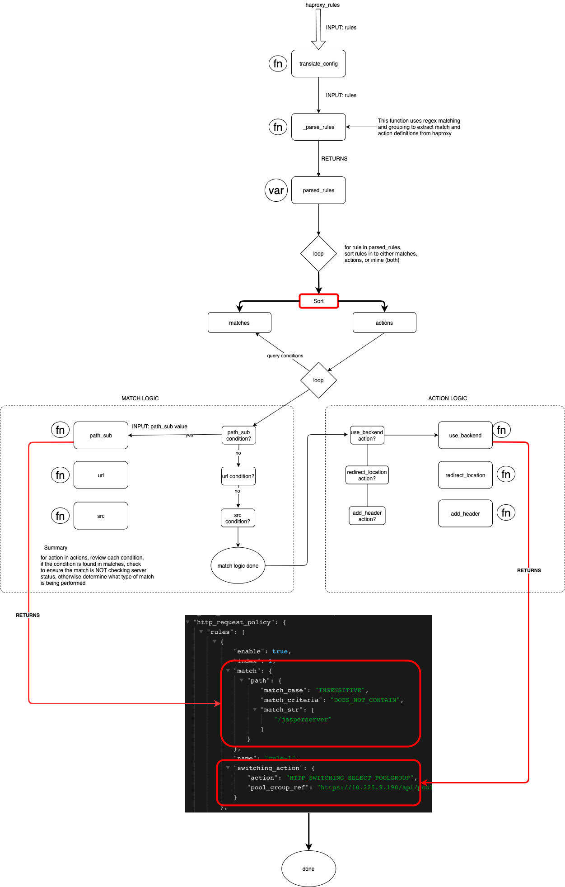

# NSX-V to Avi Use Case

## Pre-requisites
This Ansible playbook and supporting plugin filters have been tested with Python 3.9.7 and Ansible 2.13.4. It is recommended to run this automation in a virtual environment.

```
python3 -m venv env
source env/bin/activate
pip install -r requirements.txt
ansible-galaxy collection install vmware.alb
```

When done you can exit the virtual environment by issuing the `deactivate` command.

### Authentication
This playbook expects a file called `avi-credentials.yml` to be located in the vars directory. This is an example of the contents of that file
```
AVI_CREDENTIALS:
  controller: < ip or fqdn >
  username: < username >
  password: < password >
  api_version: < api version >
```

The password value can be securely provided to Ansible in a couple of ways.

- Option 1: Use Ansible Vault to encrypt the avi-credentials.yml file. https://docs.ansible.com/ansible/2.8/user_guide/vault.html
  - Step 1: Create the avi-credentials.yml according to the above template
  - Step 2: Encrypt the file using Ansible Vault: `ansible-vault encrypt avi-credentials.yml`. You will be prompted to create and confirm a vault password.
  - Step 3: When executing the playbook, supply the `--ask-vault-password` argument: `ansible-playbook main.yml --ask-vault-password`, then provide the vault password.

- Option 2: Store the password in a password tool and use an Ansible Lookup retrieve the password.
  


## Configuration
This Ansible playbook is designed such that an administrator can define high level objects to describe Avi components. When the playbook is ran, that configuration generates a collection of tasks which handle the lower level details of interacting with the Avi API. All configuration objects are configured in `variables.yml`. These variables will be used by `./templates/avi_template.j2` to generate tasks to deploy the application.

### ./variables.yml

```
STATE: present
TENANT: admin
nsxt_cloudname: cloud_nsxt

services:
  - "{{ shared_services }}"
  - "{{ ldap_389 }}"
  - "{{ ldap_636 }}"
  - "{{ smtp_25 }}"
```

An example configuration is as follows
```
web_app_443:                                            #Describes how the application is referenced above in the services key.
  name: "web_app_443"                                   #Is used to generate naming schemes
  enabled: true                                         #Can be toggled to not deploy even if the service is referenced in the services key.
  cloud: Default-Cloud                                  #Which cloud should these objects be deployed into?
  vrf_context: global                                   #VRF Context to which these objects belong (NSX-T T1)
  pool:                                                 #Object key. Each list entry will be a separate pool to be created with associated attributes.
    - name: "backend_80"
      default_server_port: 80
      lb_algorithm: "LB_ALGORITHM_LEAST_CONNECTIONS"
      health_monitor: "System-TCP"
      poolservers: ["10.203.30.16","10.203.30.17"]
  poolgroup:
    - name: backend_80
      pools:
        - name: backend_80
          priority: 10
        - name: maintenance_pool
          priority: 5
  vsvip:
    - enabled: true
      addr: "10.1.1.2"
  virtual_service:
    - name: "web_app_443"
      enabled: false
      services:
        - port: 443
          enable_ssl: true
          enable_http2: false
      application_profile: "System-Secure-HTTP"
      network_profile: System-TCP-Proxy
      terminate_ssl: true
      ssl_profile: System-Standard
      certificate: System-Default-Cert
      service_engine_group: Default-Group
      http_policies:
        - web_app_443
  httppolicyset:                                            #The httppolicyset key is responsible for any HAProxy rules which should be converted.
    - name: web_app_443
      translated_from_haproxy: true
      rules: 
        [
          {'line_number': 1, 'line': "acl whitelist src 4.4.4.0/26"},
          {'line_number': 2, 'line': "acl dashboard url_beg /dashboard"},
          {'line_number': 3, 'line': "acl admin url_beg /admin"},
          {'line_number': 4, 'line': "acl core url_beg /core"},
          {'line_number': 5, 'line': "acl user url_beg /user"},
          {'line_number': 6, 'line': "redirect location /quarantine if !whitelist dashboard"},
          {'line_number': 7, 'line': "redirect location /quarantine if !whitelist admin"},
          {'line_number': 8, 'line': "redirect location /quarantine if !whitelist core"},
          {'line_number': 9, 'line': "redirect location /quarantine if !whitelist user"},
        ]
```

### ./templates/avi_template.j2
This Jinja2 template determines if a given object has been defined in `variables.yml`. If it has not, then that object section is skipped.

For example, if the healthmonitors key was not defined in the service, Jinja2 skips this section.
```


- name: "Create Health Monitor(s) for {{ service.name }}"
  avi_healthmonitor:
    avi_credentials: {{ '"{{ AVI_CREDENTIALS }}"' }}
    name: "{{ healthmonitor.name }}"
```

Once the template step is completed, the service's tasks are output to the `./application_plays/` directory.

### ./main.yml
This is the parent playbook which pulls in `./variables.yml` and calls the Ansible template module to create tasks generated from `./templates/avi_template.j2`. Once templates have been rendered to `./application_plays`, the playbook loops through the tasks for each service that has been defined:

```
- name: Deploy Services
  include_tasks:
    file: ./application_plays/{{ service.name + '_play.yml' }}
  loop: "{{ services }}"
  loop_control:
    loop_var: service
```

# HAProxy to Avi Filter Plugin
This playbook makes use of a custom filter plugin to transform HAProxy rules from NSX-V to NSX-ALB (Avi) rules. The filter is written in Python and can be found in `./filter_plugins/filters.py`.  
<br></br>
The filter accepts data as a list of HAProxy lines along with their line number. These lines are defined in `./variables.yml`, then passed to the Jinja2 template `./templates/avi_template.j2`. In the HTTPPolicy configuration section of the Jinja2 template, the filter is called. Ansible filters take data from the left of the | and pass that data to the filter as a parameter.
```

- name: "Create HTTPPolicySet for {{ service.name }}"
  avi_httppolicyset:
    name: "{{ policy.name }}"
    state: "{{ STATE }}"
    avi_credentials: {{ '"{{ AVI_CREDENTIALS }}"' }}
    tenant_ref: "/api/tenant/?name={{ TENANT }}"
    http_request_policy:
    
      {{ policy.rules | haproxy_to_avi() }}                        <--- Here
    
      rules:
```

The filter name and method mapping are found in `./filter_plugins/filters.py`. The name of the filter, `haproxy_to_avi`, is mapped to the `translate_config` method of the FilterModule class.

```
class FilterModule(object):
    def filters(self):
        return {
            'haproxy_to_avi': self.translate_config
        }
```


```
  httppolicyset:
    - name: test_policy
      translated_from_haproxy: true
      rules: 
        [
          {'line_number': 1, 'line': "acl admin path_beg -i /admin"},
          {'line_number': 1, 'line': "acl rest_endpoint path_beg -i /rest_endpoint"},
          {'line_number': 1, 'line': "acl allowed_ip_1 src 1.1.1.0/24 2.2.2.2 3.3.3.3"},
          {'line_number': 1, 'line': "acl allowed_ip_2 src 4.4.4.0/24 5.5.5.0/22 6.6.6.6"},
          {'line_number': 1, 'line': "use_backend poolgroup1 if rest_endpoint"},
          {'line_number': 1, 'line': "use_backend poolgroup2 if admin allowed_ip_1"},
          {'line_number': 1, 'line': "use_backend poolgroup3 if allowed_ip_2"}
        ]
```

## Filter Workflow


## Known Issues / Limitations
- Inline HAProxy rules are not supported
- Block actions are not supported.
- Extra spaces within HAProxy line will cause the playbook to fail (Work In Progress)
- No Flags are accepted. For instance, match criteria is always case insensitive (-i is ignored)

## Supported Match / Action Criteria
### Match Criteria
- path_beg
- path_sub
- src
- url
- url_beg
- hdr_beg(host)
- hdr_dom(host)

### Action Criteria
- use_backend (This currently only supports pointing to Pool Groups)
- redirect location
- redirect prefix
- set-header
- inverse conditions